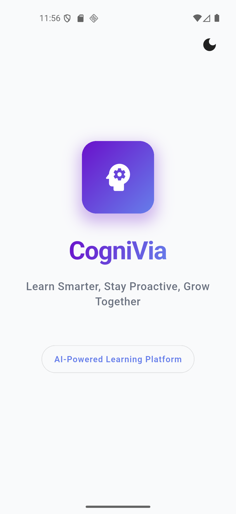
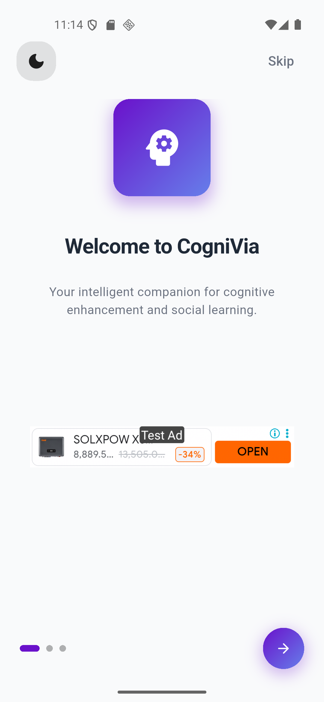
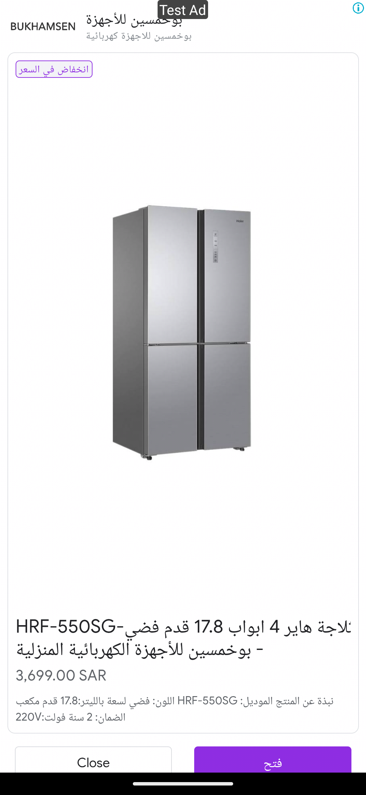
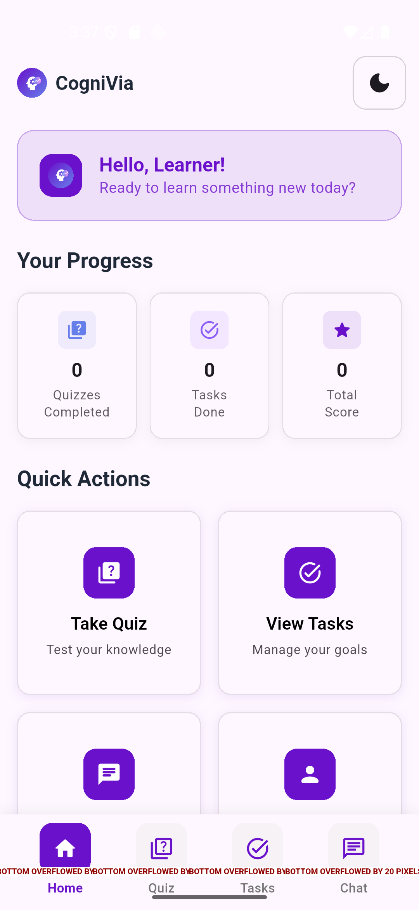
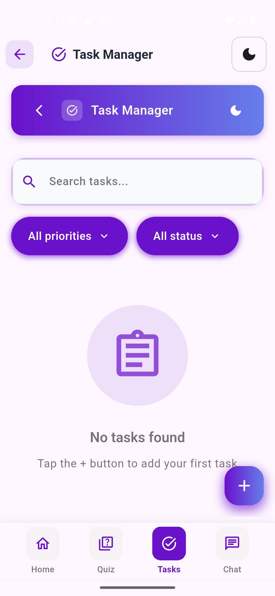

# 🧠 CogniVia – AI-Powered Cognitive Enhancement App

## 🚀 Project Overview

**CogniVia** is an intelligent cognitive enhancement application built with **Flutter** and **Firebase**, featuring AI-powered quizzes, intelligent task management, real-time community chat, and Google Mobile Ads integration. The app delivers a premium learning experience with Material Design 3 components, beautiful purple gradient themes, and seamless dark/light mode switching.

---

## 🌟 Features

- 🧠 **AI-Powered Smart Quizzes** - Intelligent quiz system with progress tracking and results analysis
- 📋 **Intelligent Task Management** - Professional task organizer with priority filtering and status tracking
- 💬 **Real-Time Community Chat** - Firebase-powered chat with WhatsApp-style message persistence
- 🎯 **Google Mobile Ads** - Integrated banner and interstitial ads for monetization
- 🎨 **Dynamic Purple Theming** - Beautiful gradient themes with professional dark/light mode toggle
- 🔐 **Firebase Authentication** - Secure email/password authentication system
- 📱 **Material Design 3** - Modern UI with professional purple headers and smooth animations
- 🏗️ **MVVM Architecture** - Clean, scalable code structure with Provider state management
- 🌐 **Cross-Platform** - Native performance on Android and iOS

---

## 📱 Screenshots

| Splash Screen | Onboarding Screen | Banner Ads | Interstitial Ads |
|------------|----------------|--------------|----------------|
|  |  |  |  |

| Main Screen | Task Manager | Quiz Challenge | Community Chat |
|------------|----------------|--------------|------------|
|  |  |  |  |

---

## 📂 Project Structure
```
lib/
│
├── main.dart                          # Application entry point
│
├── core/
│   ├── constants/
│   │   ├── app_colors.dart             # Purple gradient color scheme
│   │   └── app_strings.dart            # App text constants
│   │
│   └── services/
│       └── ad_manager.dart             # Google Mobile Ads service
│
├── data/
│   ├── models/
│   │   ├── user_model.dart             # User data model
│   │   ├── task_model.dart             # Task data model
│   │   ├── quiz_model.dart             # Quiz data model
│   │   └── chat_model.dart             # Chat & message models
│   │
│   └── services/
│       ├── auth_service.dart           # Firebase authentication
│       ├── task_service.dart           # Task management service
│       ├── quiz_service.dart           # Quiz management service
│       └── chat_service.dart           # Real-time chat service
│
├── presentation/
│   ├── navigation/
│   │   └── main_navigation.dart        # Bottom navigation with theme toggle
│   │
│   ├── providers/
│   │   ├── auth_provider.dart          # Authentication state management
│   │   ├── task_provider.dart          # Task state management
│   │   ├── quiz_provider.dart          # Quiz state management
│   │   └── chat_provider.dart          # Chat state management
│   │
│   ├── screens/
│   │   ├── onboarding/
│   │   │   └── onboarding_screen.dart  # Onboarding with banner ads
│   │   │
│   │   ├── auth/
│   │   │   ├── login_screen.dart       # Login with theme toggle
│   │   │   ├── signup_screen.dart      # Signup with theme toggle
│   │   │   └── profile_screen.dart     # User profile management
│   │   │
│   │   ├── home/
│   │   │   └── home_screen.dart        # Main dashboard
│   │   │
│   │   ├── quiz/
│   │   │   ├── quiz_screen.dart        # Quiz main screen with purple header
│   │   │   ├── quiz_play_screen.dart   # Interactive quiz gameplay
│   │   │   ├── quiz_result_screen.dart # Results with purple header
│   │   │   └── quiz_history_screen.dart# Quiz history tracking
│   │   │
│   │   ├── tasks/
│   │   │   ├── tasks_screen.dart       # Task manager with purple header
│   │   │   └── add_edit_task_screen.dart # Task creation/editing
│   │   │
│   │   └── chat/
│   │       ├── chat_screen.dart        # Community chat with purple header
│   │       └── chat_detail_screen.dart # Individual chat conversation
│   │
│   └── widgets/
│       └── common/
│           ├── cognivia_logo.dart      # App logo widget
│           ├── task_card.dart          # Professional task card
│           └── real_chat_tile.dart     # Chat tile widget
```

---

## 🧠 Skills Demonstrated

- 🏛️ **MVVM Architecture** - Clean separation with Model-View-ViewModel pattern
- 🔥 **Firebase Integration** - Authentication, Realtime Database for chat persistence
- 📊 **State Management** - Efficient Provider pattern with theme management
- 🎨 **Custom UI Design** - Material Design 3 with purple gradient themes
- 💰 **Ad Integration** - Google Mobile Ads with banner and interstitial ads
- 🔐 **Security** - Firebase authentication with secure data handling
- ⚡ **Performance** - Optimized list rendering and real-time updates
- 🧪 **Code Quality** - Maintainable, scalable, and well-documented codebase

---

## 🛠 Technologies Used

- **Flutter** (Dart) - Cross-platform mobile development framework
- **Firebase** - Authentication, Realtime Database for chat functionality
- **Google Mobile Ads** - Banner and interstitial ad monetization
- **Provider** - State management solution with theme handling
- **Material Design 3** - Modern UI components with purple gradient design

---

## 🚀 Getting Started

### Prerequisites
- Flutter SDK (version 3.8.1 or higher)
- Dart SDK (included with Flutter)
- Android Studio or VS Code with Flutter plugin
- Firebase project setup
- Google AdMob account

### Installation
1. **Clone the repository**
   ```bash
   git clone https://github.com/M-Attaullah/Cognivia-App
   cd Cognivia-App
    ```
   
2. **Install dependencies**
   ```bash
   flutter pub get
   ```

3. **Firebase Setup**
   - Create a new Firebase project at [Firebase Console](https://firebase.google.com/)
   - Enable Authentication with Email/Password provider
   - Enable Realtime Database with these rules:
     ```bash
     {
        "rules": {
          "chats": {
            ".read": "auth != null",
            ".write": "auth != null"
          },
          "chatMessages": {
            ".read": "auth != null",
            ".write": "auth != null"
          },
          "userChats": {
            ".read": "auth != null",
            ".write": "auth != null"
          }
        }
     }
     ```
   - Download and add  ```google-services.json ``` to  ```android/app/ ```
   - Download and add  ```GoogleService-Info.plist ``` to  ```ios/Runner/ ```

4. **AdMob Setup**
   - Create AdMob account at [AdMob Console](https://admob.google.com/)
   - Create new app with name "CogniVia"
   - Create Banner ad unit: "CogniVia Banner"
   - Create Interstitial ad unit: "CogniVia Interstitial" 
   - Add App ID to `android/app/src/main/AndroidManifest.xml`:
     ```xml
     <meta-data
         android:name="com.google.android.gms.ads.APPLICATION_ID"
         android:value="ca-app-pub-XXXXXXXX~XXXXXXXXX"/>
     ```
   - Add App ID to `ios/Runner/Info.plist`:
     ```xml
     <key>GADApplicationIdentifier</key>
     <string>ca-app-pub-XXXXXXXX~XXXXXXXXX</string>
     ```
   - Update ad unit IDs in `lib/core/services/ad_manager.dart`:
     ```dart
     static const String _bannerAdUnitId = 'ca-app-pub-XXXXXXXX/XXXXXXXXX';
     static const String _interstitialAdUnitId = 'ca-app-pub-XXXXXXXX/XXXXXXXXX';
     ```
       
4. **Run the app**
   ```bash
   flutter run
   ```

---

## 📦 Dependencies

```yaml
dependencies:
  flutter:
    sdk: flutter
  firebase_core: ^2.30.0                    # Firebase core functionality
  firebase_auth: ^4.17.8                    # Firebase authentication
  firebase_database: ^10.4.8                # Realtime database for chat
  google_mobile_ads: ^5.3.1                 # Google Mobile Ads integration
  provider: ^6.1.2                          # State management
  cupertino_icons: ^1.0.2                   # iOS style icons
  
dev_dependencies:
  flutter_test:
    sdk: flutter
  flutter_lints: ^5.0.0                     # Code linting
```

---

## 🎯 Key Features Implementation

### 🧠 AI-Powered Quiz System
- Smart question generation and scoring  
- Progress tracking with detailed analytics  
- Professional purple headers with theme toggle  
- Quiz history and performance metrics  

### 📋 Intelligent Task Management
- Priority-based task filtering  
- Professional search and filter UI  
- Real-time task status updates  
- Beautiful gradient styling  

### 💬 Real-Time Chat
- Firebase Realtime Database integration  
- WhatsApp-style message persistence  
- Professional gradient search functionality  
- Instant message delivery  

### 🎯 Google Mobile Ads
- Persistent banner ads in onboarding  
- Strategic interstitial ad placement  
- Optimized ad loading and display  

## 🎨 Design System

**Color Palette**
- Primary Purple: `Color(0xFF6C63FF)` *(gradientStart)*  
- Secondary Purple: `Color(0xFF9C7EFF)` *(gradientEnd)*  
- Dark Theme: Professional dark backgrounds  
- Light Theme: Clean white and gray tones  

**Typography**
- Material Design 3 typography scale  
- Professional headers with white text on purple  
- Gradient text effects for emphasis  


---

## 🎯 Future Enhancements

- [ ] 🤖 Advanced AI quiz personalization
- [ ] 📊 Detailed analytics dashboard
- [ ] 👥 Group chat functionality
- [ ] 🔔 Push notifications
- [ ] 📱 Tablet optimization
- [ ] 🌍 Multi-language support
- [ ] 🎵 Voice messages in chat
- [ ] 📈 Advanced progress tracking


---

## 🙌 Author

**Muhammad Attaullah**  
Feel free to connect or contribute to this project.

[](https://github.com/M-Attaullah) [*M-Attaullah*](https://github.com/M-Attaullah)  
[](https://www.linkedin.com/in/muhammad-attaullah-705764333/) [*Muhammad Attaullah*](https://www.linkedin.com/in/muhammad-attaullah-705764333/)

---

> 📌 *CogniVia was developed as a final internship project, combining multiple modules including Firebase authentication, real-time chat, task management, quiz system, and Google Mobile Ads integration with professional Flutter development practices and modern Material Design 3 UI.*

